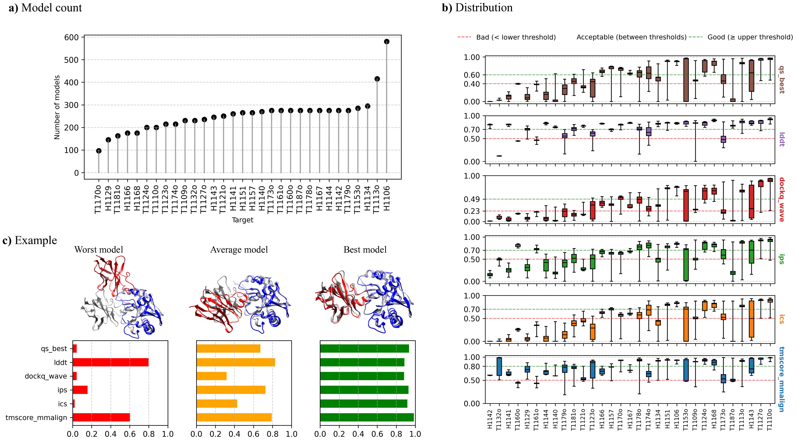
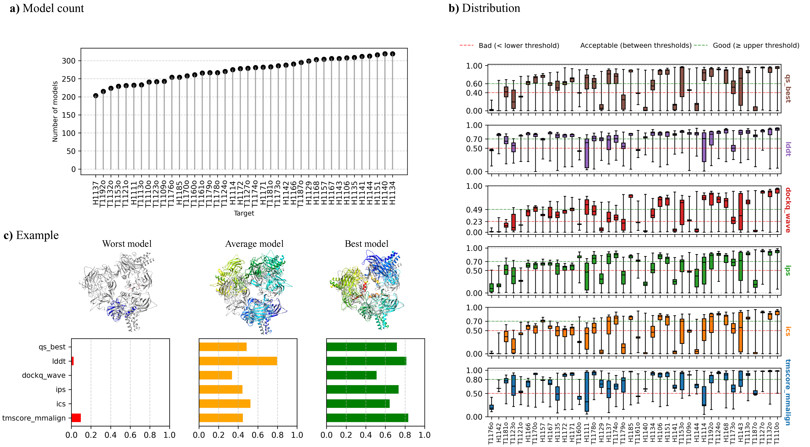
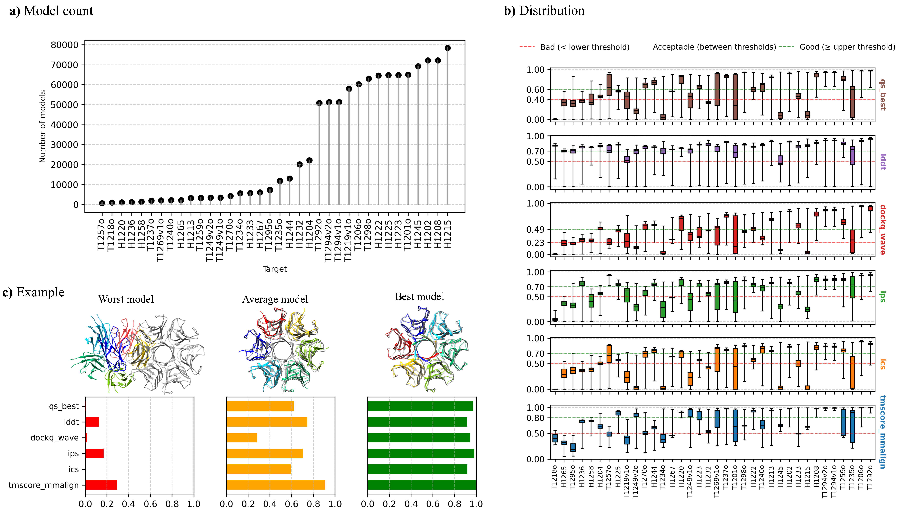
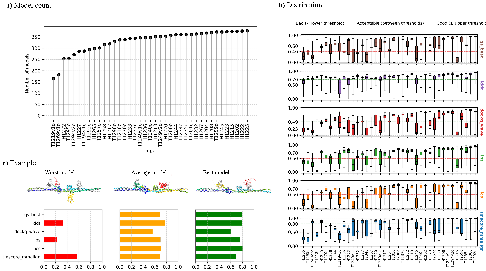

# PSBench
A large-scale benchmark for developing and evaluating methods for estimating protein complex structural model accuracy (EMA). It includes four components: (I) datasets for training and evaluating EMA methods; (II) scripts to evaluate the prediction results of EMA methods on the datasets; (III) scripts to label new benchmark datasets; and (IV) baseline EMA methods which users can compare their EMA methods with. 


### Data Repository at Harvard Dataverse
The datasets in PSBench can be downloaded from the Harvard Dataverse repository here: https://dataverse.harvard.edu/dataset.xhtml?persistentId=doi:10.7910/DVN/75SZ1U


DOI : https://doi.org/10.7910/DVN/75SZ1U

## PSBench Installation

### Clone the repository
```
git clone https://github.com/BioinfoMachineLearning/PSBench.git
cd PSBench/ 
```
### Setup the environment
```
#create the PSBench environment
conda create -n PSBench python=3.10.12

# activate PSBench
conda activate PSBench

#install the required packages
pip install -r scripts/requirements.txt
```
### Setup and test OpenStructure
```
# install OpenStructure
docker pull registry.scicore.unibas.ch/schwede/openstructure:latest

# test OpenStructure installation 
docker run -it registry.scicore.unibas.ch/schwede/openstructure:latest --version
```

## I. Datasets for training and testing EMA methods
PSBench consists of the following 4 complementary large datasets for training and testing EMA methods, which can be downloaded from the Harvard Dataverse repository above: 
1. CASP15_inhouse_dataset
2. CASP15_community_dataset
3. CASP16_inhouse_dataset
4. CASP16_community_dataset

In addition, CASP15_inhouse_TOP5_dataset (a subset of CASP15_inhouse_dataset) and CASP16_inhouse_TOP5_dataset (a subset of CASP16_inhouse_dataset) are also included into the PSBench. The two subsets were used to train and test GATE (a graph transformer EMA method) respectively. Users may train and test their machine learning methods on the same subsets and compare the results with GATE. 
   
## The dataset directory structure

After the datasets are downloaded from Harvard Dataverse and unzipped, the structure of the four main datasets should be:

```text
📁 PSBench/
├── 📁 CASP15_inhouse_dataset/
│   ├── 📄 CASP15_inhouse_dataset_summary.tab
│   ├── 📁 AlphaFold_Features/
│   ├── 📁 Fasta/
│   ├── 📁 Predicted_Models/
│   └── 📁 Quality_Scores/
├── 📁 CASP15_inhouse_TOP5_dataset/
│   ├── 📄 CASP15_inhouse_TOP5_dataset_summary.tab
│   ├── 📁 AlphaFold_Features/
│   ├── 📁 Fasta/
│   └── 📁 Quality_Scores/
├── 📁 CASP15_community_dataset/
│   ├── 📄 CASP15_community_dataset_summary.tab
│   ├── 📁 Fasta/
│   ├── 📁 Predicted_Models/
│   └── 📁 Quality_Scores/
├── 📁 CASP16_inhouse_dataset/
├── 📁 CASP16_inhouse_TOP5_dataset/
├── 📁 CASP16_community_dataset/
└── 📄 README.md

```

Note: The two subsets (CASP15_inhouse_TOP5_dataset and CASP16_inhouse_TOP5_dataset) do not include the Predicted_Models directories to minimize redundancy and optimize storage. The models in the two subsets are identical to those already available in their respective full datasets (CASP15_inhouse_dataset/Predicted_Models/ and CASP16_inhouse_dataset/Predicted_Models/). Users can put the downloaded datasets anywhere or in the installation directory of PSBench (recommended for easy management). 

## Quality scores (labels)
For each of the datasets, we provide the following 10 unique quality scores as labels:

| Category | Quality scores |
|:---------|:-------------------|
| **Global Quality Scores** | tmscore (4 variants), rmsd |
| **Local Quality Scores** | lddt |
| **Interface Quality Scores** | ics, ics_precision, ics_recall, ips, qs_global, qs_best, dockq_wave |

## Additional features

For CASP15_inhouse_dataset and CASP16_inhouse_dataset, as well as their subsets (i.e., CASP15_inhouse_TOP5_dataset and CASP16_inhouse_TOP5_dataset), the following additional features are provided for each model:

| Feature               | Description                                                       |
|-----------------------|-------------------------------------------------------------------|
| `model_type`          | Indicates model type (AlphaFold-multimer or AlphaFold3)     |
| `afm_confidence_score`| AlphaFold-multimer confidence score                               |
| `af3_ranking_score`   | AlphaFold3 ranking score                                          |
| `iptm`                | Interface predicted Template Modeling score                       |
| `num_inter_pae`       | Number of inter-chain predicted aligned errors (<5 Å)             |
| `mpDockQ/pDockQ`      | Predicted multimer DockQ score                                    |


For detailed explanations of each quality score and feature, please refer to [Quality_Scores_Definitions](jsons/Quality_Scores_Definitions.json)

<details>
  
In each figures below, there are three pieces of information: **(a) Model count.** Number of models per target in the dataset. **(b) Score Distribution.** Box plots of each of six representative quality scores of the models for each target. **(c) Example.** Three representative models (worst, average, best) in terms of sum of the six representative quality scores for a target. Each model with two chains colored in blue and red is superimposed with the true structure in gray.

## i. CASP15_inhouse_dataset
CASP15_inhouse_dataset consists of a total of 7,885 models generated by MULTICOM3 during the 2022 CASP15 competition. Example target in Figure (c): H1143. 


**CASP15_inhouse_TOP5_dataset** is a subset curated for GATE-AFM from the **CASP15_inhouse_dataset**, consisting of the top 5 models per predictor. Each predictor varies in its use of input multiple sequence alignments (MSAs), structural templates, and AlphaFold configuration parameters to generate structural models using the AlphaFold. 

## ii. CASP15_community_dataset
CASP15_community_dataset consists of a total of 10,942 models generated by all the participating groups during the 2022 CASP15 competition. Example target in Figure (c): H1135. 


## iii. CASP16_inhouse_dataset
CASP16_inhouse_dataset consists of a total of 1,009,050 models generated by MULTICOM4 during the 2024 CASP16 competition. Example target in Figure (c): T1235o. 


**CASP16_inhouse_TOP5_dataset** is a subset curated for GATE-AFM from the **CASP16_inhouse_dataset**, consisting of the top 5 models per predictor. Each predictor varies in its use of input multiple sequence alignments (MSAs), structural templates, and AlphaFold configuration parameters to generate structural models using the AlphaFold program. 

## iv. CASP16_community_dataset
CASP16_community_dataset consists of a total of 12,904 models generated by all the participating groups during the 2024 CASP16 competition. Example target in Figure (c): H1244. 

</details>

## II. Script to evaluate EMA methods on a benchmark dataset

This script (evaluate_QA.py) is used to evaluate and compare how well different EMA methods perform. It calculates how closely the quality scores predicted by each EMA method for the structural models in a dataset match the true quality scores in terms of four metrics, including Pearson correlation, Spearman correlation, top-1 ranking loss, and AUROC.

### Command:

```bash
python scripts/evaluate_QA.py \
  --input_dir $INPUT_DIR \ 
  --native_dir $NATIVE_DIR \ 
  --true_score_field $TRUE_SCORE_FIELD
```

### Arguments:

| Argument               | Description |
|------------------------|-------------|
| `--input_dir`              | Input directory with model quality prediction files that includes predicted quality scores by one or more EMA methods for each model |
| `--native_dir`          | Directory containing the true model quality scores (labels) of structural models for each target. The true model quality scores are available in each of the benchmark datasets (CASP15_community_dataset, CASP15_inhouse_dataset, CASP16_inhouse_dataset, CASP16_community_dataset) downloaded from the Harvard Dataverse repository. |
| `--true_score_field` | Name of the column in the true score file that contains the true quality score to be evaluated against. Default is `tmscore_usalign` |
| `--ema_method`        | (Optional) The name of the EMA method column in the prediction file that you want to evaluate. If not provided, the script will evaluate the model quality prediction scores of all the EMA methods |
| `--outfile`            | 	(Optional) The name of the CSV file where the evaluation results will be saved. Default is `evaluation_results.csv` |

#### Example: 
Run the command below in the installation directory of PSBench:
```bash
python scripts/evaluate_QA.py \
  --indir ./Examples/Predictions \
  --nativedir ./true_scores \
  --native_score_field tmscore_usalign_aligned
```

### Format of model quality prediction files

Each prediction file should be a CSV file in the following format:
- The first row is a header row, including the column names (e.g., model, EMA method 1, EMA method 2, ...).
- The first column starting from the second row should be the names of structural models (e.g., model1, model2).
- The remaining columns should be predicted quality scores for the models from one or more EMA methods (e.g., EMA method 1, EMA method 2).

```
model,EMA1,EMA2,...
model1,0.85,0.79, ...
model2,0.67,0.71, ...
```

Example of a model quality prediction file (Examples/Predictions/H1202.csv):
```
model,PSS,DProQA,VoroIF-GNN-score,VoroIF-GNN-pCAD-score,VoroMQA-dark,GCPNet-EMA,GATE-AFM
deepmsa2_14_ranked_2.pdb,0.9545535989717224,0.02895,0.0,0.0,0.0,0.7771772742271423,0.5923953714036315
afsample_v2_ranked_2.pdb,0.8873916966580978,0.0066,0.0,0.0,0.0,0.7705466747283936,0.575105558750621
def_mul_tmsearch_ranked_0.pdb,0.9609340102827764,0.02353,0.0,0.0,0.0,0.7641939520835876,0.5981529354257233
deepmsa2_1_ranked_4.pdb,0.96272264781491,0.02055,0.0,0.0,0.0,0.7685595154762268,0.5959772306691834
deepmsa2_1_ranked_2.pdb,0.9606568380462726,0.02318,0.0,0.0,0.0,0.7671180963516235,0.5983494717414063
afsample_v2_r21_not_ranked_1.pdb,0.9234104884318768,0.0192,0.0,0.0,0.0,0.7699458599090576,0.5879402631363266
deepmsa2_0_ranked_3.pdb,0.9607991259640104,0.02123,0.0,0.0,0.0,0.7682469487190247,0.5953465198918304
afsample_v1_r21_not_ranked_1.pdb,0.9156177377892032,0.02246,0.0,0.0,0.0,0.7822033762931824,0.5772502685580536
folds_iter_esm_1_ranked_1.pdb,0.9471744215938304,0.01475,0.0,0.0,0.0,0.7621756196022034,0.5904867273330673
deepmsa2_15_ranked_3.pdb,0.956274524421594,0.02606,0.0,0.0,0.0,0.7756944894790649,0.5937158219111754
```

### Output:

The script generates a CSV file summarizing the evaluation results. Each row corresponds to a different target (e.g., a protein complex), and for each EMA method, the following metrics are reported:
- *_pearson: How strongly the predicted scores correlate with the true scores (Pearson correlation).
- *_spearman: A rank-based version of correlation (Spearman correlation).
- *_loss: The difference between the quality score of the truely best model of a target and that of the top-ranked model selected by the predicted quality scores.
- *_auroc: AUROC from ROC analysis, measuring how well the EMA method distinguishes high-quality models (top 25%) from others.
    
## III. Scripts to generate labels for a new benchmark dataset
Users can use the tools in PSBench to create their own benchmark dataset. Following are the prerequisites to generate the labels for a new benchmark dataset:
### Data:
- Predicted protein complex structures (structural models)
- Native (true) structures
- Protein sequence files in FASTA format
### Tools (Downloaded or installed in the PSBench installation section)
 - OpenStructure
 - USalign
 - Clustalw

<!-- <details>

Download the PSBench repository and cd into scripts

```bash
git clone https://github.com/BioinfoMachineLearning/PSBench.git
cd PSBench
cd scripts
```

#### Openstructure Installation (Need to run only once)
```bash
docker pull registry.scicore.unibas.ch/schwede/openstructure:latest
```

Check the docker installation with 
```bash
# print the installed latest version of openstructure 
docker run -it registry.scicore.unibas.ch/schwede/openstructure:latest --version
``` -->

#### Quality Scores Generation for Predicted Structural Models

#### Run the generate_quality_scores.sh pipeline

```bash
sh generate_quality_scores.sh \
  --fasta_dir $FASTA_DIR \
  --predicted_dir $PREDICTED_DIR \
  --native_dir $NATIVE_DIR \
  --outdir $OUTDIR \
  --usalign $USALIGN \
  --clustalw $CLUSTALW \
  --targets $TARGETS
```

#### Required Arguments:

| Argument         | Description                                                                                      |
|------------------|--------------------------------------------------------------------------------------------------|
| `--fasta_dir`     | Path to the directory containing protein sequence files in FASTA format (named as `<target>.fasta`)                        |
| `--predicted_dir` | Path to the base directory containing predicted models (subdirectory per target)                |
| `--native_dir`    | Path to the directory containing native protein structure files in PDB format (named as `<target>.pdb`)                     |
| `--outdir`        | Path to the base output directory for results                                                   |
| `--usalign`       | Path to the USalign program (e.g., `tools/USalign`)                                              |
| `--clustalw`      | Path to the ClustalW program (e.g., `tools/clustalw1.83/clustalw`)                               |
| `--targets`       | Space-separated list of target names to process (e.g., `H1204 H1213`)                           |

For each target (e.g. `H1204`), ensure the following:

- Sequence file in FASTA format: `/path/to/PSBench/Fasta/H1204.fasta`
- Predicted structural models: `/path/to/PSBench/predicted_models/H1204/*.pdb`
- Native (true) structure in the PDB format: `/path/to/PSBench/native_models/H1204.pdb`

#### Example:

```bash
cd scripts/
sh generate_quality_scores.sh \
  --fasta_dir /path/to/PSBench/Fasta/ \
  --predicted_dir /path/to/PSBench/predicted_models/ \
  --native_dir /path/to/PSBench/native_models/ \
  --outdir /path/to/PSBench/output/ \
  --usalign /path/to/PSBench/scripts/tools/USalign \
  --clustalw /path/to/PSBench/scripts/tools/clustalw1.83/clustalw \
  --targets H1204 H1213

```
#### Output:
Output folder will have subdirectories for each target (eg. /path/to/PSBench/output/ will have H1204/ H1213/). Each target subdirectory will have the following:

- filtered_pdbs/ : directory where aligned and filtered structural models and native structures are saved
- H1204_quality_scores.csv : CSV containing the true quality scores for each model of the target
- results/ : directory where outputs of OpenStructure and USalign runs are saved
- temp/ : temporary working directory for structure alignment and filtering process


#### Optional : Generate AlphaFold features when available

<details>

#### Run the generate_af_features.sh pipeline

##### Required Arguments:
| Argument       | Description                                                                                      |
|----------------|--------------------------------------------------------------------------------------------------|
| `--fasta_dir`  | Directory containing FASTA files for each target (e.g., `/path/to/fasta`)                        |
| `--pdb_dir`    | Directory containing predicted structural model subfolders (e.g., `/path/to/pdbs`)                      |
| `--pkl_dir`    | Directory containing AlphaFold pickle (.pkl) subfolders (e.g., `/path/to/pkls`)                 |
| `--outdir` | Directory where output CSV files will be saved (e.g., `/path/to/outdir`)                    |
| `--targets`    | List of target names (e.g., `H1204 H1213`)                                                       |

For each target (e.g. `H1204`), ensure the following:

- FASTA file: `/path/to/PSBench/Fasta/H1204.fasta`
- Predicted models: `/path/to/PSBench/predicted_models/H1204/*.pdb`
- Pickle files: `/path/to/PSBench/predicted_models_pickles/H1204/*.pkl`

#### Example:

```bash
cd scripts/
sh generate_af_features.sh \
  --fasta_dir /path/to/PSBench/Fasta/ \
  --predicted_dir /path/to/PSBench/predicted_models/ \
  --pkl_dir /path/to/PSBench/predicted_models_pickles/ \
  --outdir /path/to/PSBench/output/ \
  --targets H1204 H1213
```
#### Output:
Output folder will have target_af_features.csv for each target (eg. H1204_af_features.csv).

</details>

## IV. Baseline EMA methods for comparison with a new EMA method

Here are several publicly available baseline EMA methods which users can comapre their methods with:

- **GATE** [[Liu et al., 2025]](https://github.com/BioinfoMachineLearning/gate):  
  A multi-model EMA approach leveraging graph transformers on pairwise similarity graphs. Combines single-model and multi-model features for TM-score prediction.  
  🔗 GitHub: [https://github.com/BioinfoMachineLearning/gate](https://github.com/BioinfoMachineLearning/gate)  
  - **GATE-AFM**: An enhanced version of GATE that incorporates AlphaFold-Multimer features as node features.

- **DProQA** [[Chen et al., 2023]](https://github.com/jianlin-cheng/DProQA):  
  A single-model EMA method using a Gated Graph Transformer. Targets interface quality prediction (e.g., DockQ scores) using KNN-based structural graphs.  
  🔗 GitHub: [https://github.com/jianlin-cheng/DProQA](https://github.com/jianlin-cheng/DProQA)

- **VoroMQA-dark, VoroIF-GNN-score, VoroIF-GNN-pCAD-score** [[Olechnovič et al., 2023]](https://github.com/kliment-olechnovic/ftdmp):  
  Interface-focused EMA methods using Voronoi-based atomic contact areas and GNNs.  
  🔗 GitHub: [https://github.com/kliment-olechnovic/ftdmp](https://github.com/kliment-olechnovic/ftdmp)

- **GCPNet-EMA** [[Morehead et al., 2024]](https://github.com/BioinfoMachineLearning/GCPNet-EMA):  
  A 3D graph neural network predicting lDDT and global accuracy from atomic point clouds. Adaptable to protein complex structures.  
  🔗 GitHub: [https://github.com/BioinfoMachineLearning/GCPNet-EMA](https://github.com/BioinfoMachineLearning/GCPNet-EMA)

- **PSS (Pairwise Similarity Score)** [[Roy et al., 2023]](https://github.com/BioinfoMachineLearning/MULTICOM_qa):  
  A multi-model consensus method using average pairwise TM-scores (via MMalign).  
  🔗 GitHub: [MULTICOM_qa](https://github.com/BioinfoMachineLearning/MULTICOM_qa)  
  🔗 Simplified: [mmalign_pairwise.py](https://github.com/BioinfoMachineLearning/gate/blob/main/gate/feature/mmalign_pairwise.py)

It is worth noting that CASP15_inhouse_dataset and CASP16_inhouse_dataset contain AlphaFold-Multimer self-estimated confidence scores for the structural models in the two datasets. They can also serve as a baseline to be compared with new EMA methods. 

## Acknowledgement
PSBench builds upon the source code and data from the following projects::
- [AlphaFold2](https://github.com/google-deepmind/alphafold)
- [AlphaFold3](https://github.com/google-deepmind/alphafold3) 
- [USAlign](https://zhanggroup.org/US-align/)
- [OpenStructure](https://git.scicore.unibas.ch/schwede/openstructure.git)
- [CASP15](https://predictioncenter.org/casp15/)
- [CASP16](https://predictioncenter.org/casp16/)


## Reference
Neupane, P., Liu, J., Cheng, J. (2025) PSBench: a large-scale benchmark for estimating the accuracy of protein complex structural models. Submitted. 
