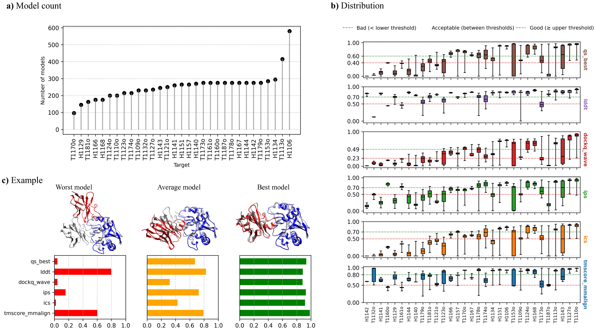
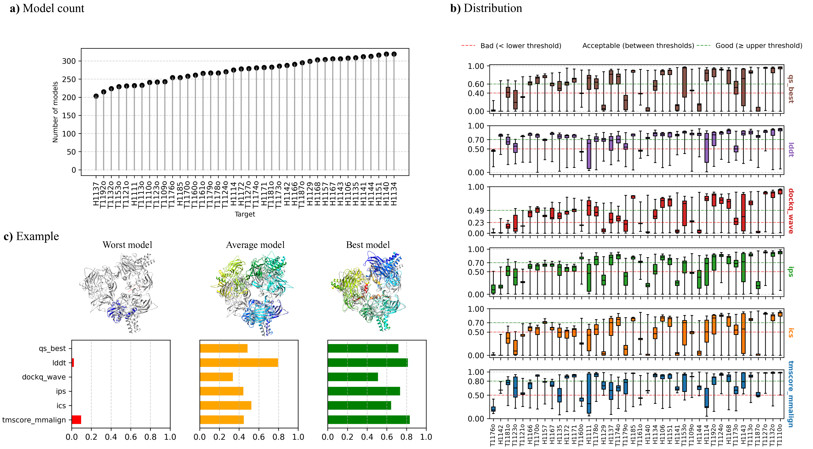
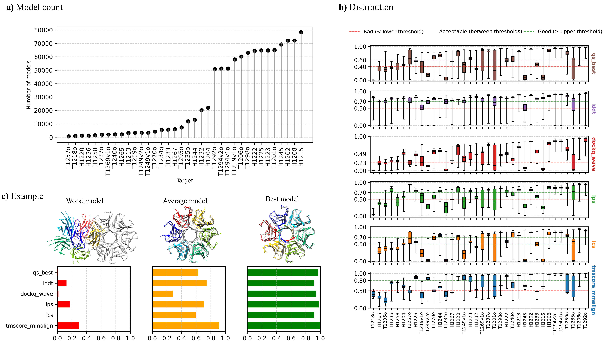
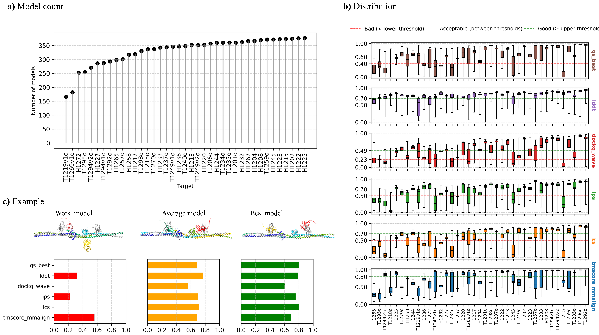

# PSBench
A comprehensive benchmark for estimating the accuracy of protein complex structural models (EMA)


## I. Four datasets for training and testing EMA methods
PSBench consists of 4 complementary datasets:
- 1. CASP15_inhouse_dataset
- 2. CASP15_community_dataset
- 3. CASP16_inhouse_dataset
- 4. CASP16_community_dataset

For each of the four datasets, we provide 10 unique quality scores and a few AlphaFold features:

| Category | Quality scores / features |
|:---------|:-------------------|
| **Global Quality Scores** | tmscore (4 variants), rmsd |
| **Local Quality Scores** | lddt |
| **Interface Quality Scores** | ics, ics_precision, ics_recall, ips, qs_global, qs_best, dockq_wave |
| **Additional Input Features** (CASP15_inhouse_dataset and CASP16_inhouse_dataset) | type, afm_confidence_score, af3_ranking_score, iptm, num_inter_pae, mpDockQ/pDockQ |

For detailed explanations of each quality score and feature, please refer to [Quality_Scores_Definitions](Datasets/Quality_Scores_Definitions.json)

<details>
For each figures below, (a) Model count. Number of models per target in the dataset. (b) Score Distribution. Box plots of each of six representative quality scores of the models for each target. (c) Example. Three representative models (worst, average, best) in terms of sum of the six representative quality scores for a target. Each model with two chains colored in blue and red is superimposed with the true structure in gray.

## i. CASP15_inhouse_dataset
CASP15_inhouse_dataset consists of a total of 7,885 models generated by MULTICOM3 during the 2022 CASP15 competition. Example target in Figure (c): H1143. 



## ii. CASP15_community_dataset
CASP15_community_dataset consists of a total of 10,942 models generated by all the participating groups during the 2022 CASP15 competition. Example target in Figure (c): H1135. 


## iii. CASP16_inhouse_dataset
CASP16_inhouse_dataset consists of a total of 1,009,050 models generated by MULTICOM4 during the 2024 CASP16 competition. Example target in Figure (c): T1235o. 


## iv. CASP16_community_dataset
CASP16_community_dataset consists of a total of 12,904 models generated by all the participating groups during the 2024 CASP16 competition. Example target in Figure (c): H1244. 

</details>

## II. Scripts to evaluate EMA methods on a benchmark dataset

This script evaluates Pearson correlation, Spearman correlation, top-1 loss, and ROC AUC for one or more scoring fields.

### Example command:

```bash
python scripts/evaluate_QA.py \
  --indir ./predictions \
  --nativedir ./native_scores \
  --native_score_field tmscore_usalign
```

### Arguments:

| Argument               | Description |
|------------------------|-------------|
| `--indir`              | Directory with prediction CSV files |
| `--nativedir`          | Directory with native score CSV files |
| `--native_score_field` | Column name of native score. Default is `tmscore_usalign` |
| `--field`              | (Optional) Score column to evaluate. If omitted, all columns from column 2 onward are evaluated, assuming 'model' is column 1 |

### Prediction files (CSV format)
Each file should contain:
```
model,EMA_score1,EMA_score2,...
model1,0.85,0.79
model2,0.67,0.71
```

### Output

The script prints:
- The evaluated fields (EMA score names)
- Target names (e.g., H1106)
- For each target:
  - Pearson correlation
  - Spearman correlation
  - Top-1 loss: native score difference between the best model and the top-1 model ranked by the EMA scores
  - RUAOC using top 25% native score threshold
    
## III. Scripts to generate labels for a new benchmark dataset
Following are the prerequisites to generate the labels for new benchmark dataset:
### Data:
- Predicted structures
- Native structure
- Fasta file
### Tools
 - Openstructure
 - USalign

<details>

Download the PSBench repository and cd into scripts

```bash
    git clone https://github.com/BioinfoMachineLearning/PSBench.git
    cd PSBench
    cd scripts
```

#### Openstructure Installation (Need to run only once)
```bash
docker pull registry.scicore.unibas.ch/schwede/openstructure:latest
```

Check the docker installation with 
```bash
# should print the latest version of openstructure 
docker run -it registry.scicore.unibas.ch/schwede/openstructure:latest --version
```

#### Run the generate_labels pipeline

Requires 6 arguments:
- --fasta : path to the fasta file for the target
- --indir : path to the predicted pdbs directory for the target
- --nativedir : path to the native pdb file for the target
- --outdir : path to the output directory
- --usalign_program : path to the USalign binary (available at tools/USalign)
- --clustalw_program : path to the clustalw binary (available at tools/clustalw1.83/clustalw)

Example

```
python generate_labels.py --fasta /path/to/H1204.fasta --indir /directory/to/H1204_predicted_models/ --nativedir /path/to/H1204_native.pdb --outdir /path/to/output/directory/ --usalign_program /path/to/USalign --clustalw_program /path/to/clustalw1.83/clustalw
```
Result folder will have following:
- filtered_pdbs : directory where filtered predicted and native structures are saved
- H1204.csv : CSV containing the labels for each model
- results : directory where outputs of OpenStructure and USalign runs are saved
- temp : temporary directory for pdb filtration process

##### Generate labels for multiple targets in bulk:
Run the generate_labels_bulk.sh

Requires 7 arguments. Targets should be listed at the end separated by space.

Example: for each target (e.g. `H1204`), ensure the following:

- FASTA file: `/directory/to/fasta_files/H1204.fasta`
- Predicted models: `/directory/to/predicted_pdb_files/H1204/*.pdb`
- Native PDB: `/directory/to/native_pdb_files/H1204.pdb`

```
sh generate_labels_bulk.sh \
  /directory/to/fasta_files \
  /directory/to/predicted_pdb_files \
  /directory/to/native_pdb_files \
  /directory/to/output_folder \
  /path/to/USalign_binary \
  /path/to/clustalw_binary \
  H1202 H1204 T1257
```

#### Optional : Generate AlphaFold features when available

Requires 4 arguments:
- --fasta : path to the fasta file for the target
- --pdbdir : path to the predicted pdbs directory for the target
- --nativedir : path to the AlphaFold generated pickle files for the predicted pdbs for the target (make sure the names are identical for files except the extensions)
- --outcsv : path to the output csv

Example
```
python generate_af_features.py --fasta /path/to/H1204.fasta --pdbdir /directory/to/H1204_predicted_models/ --pkldir /directory/to/H1204_pkl_files/ --outcsv /path/to/H1204_af_features.csv
```
</details>

## IV. Baseline EMA methods for comparison with a new EMA method

Here are several established methods for Estimating Model Accuracy (EMA), with links to their source code:

- **GATE** [[Liu et al., 2025]](https://github.com/BioinfoMachineLearning/gate):  
  A multi-model EMA approach leveraging graph transformers on pairwise similarity graphs. Combines single-model and multi-model features for TM-score prediction.  
  🔗 GitHub: [https://github.com/BioinfoMachineLearning/gate](https://github.com/BioinfoMachineLearning/gate)  
  - **GATE-AFM**: An enhanced version of GATE that incorporates AlphaFold-Multimer features as node features.

- **DProQA** [[Chen et al., 2023]](https://github.com/jianlin-cheng/DProQA):  
  A single-model EMA method using a Gated Graph Transformer. Targets interface quality prediction (e.g., DockQ scores) using KNN-based structural graphs.  
  🔗 GitHub: [https://github.com/jianlin-cheng/DProQA](https://github.com/jianlin-cheng/DProQA)

- **VoroMQA-dark, VoroIF-GNN-score, VoroIF-GNN-pCAD-score** [[Olechnovič et al., 2023]](https://github.com/kliment-olechnovic/ftdmp):  
  Interface-focused EMA methods using Voronoi-based atomic contact areas and GNNs.  
  🔗 GitHub: [https://github.com/kliment-olechnovic/ftdmp](https://github.com/kliment-olechnovic/ftdmp)

- **GCPNet-EMA** [[Morehead et al., 2024]](https://github.com/BioinfoMachineLearning/GCPNet-EMA):  
  A 3D graph neural network predicting lDDT and global accuracy from atomic point clouds. Adaptable to protein complex structures.  
  🔗 GitHub: [https://github.com/BioinfoMachineLearning/GCPNet-EMA](https://github.com/BioinfoMachineLearning/GCPNet-EMA)

- **PSS (Pairwise Similarity Score)** [[Roy et al., 2023]](https://github.com/BioinfoMachineLearning/MULTICOM_qa):  
  A multi-model consensus method using average pairwise TM-scores (via MMalign).  
  🔗 GitHub: [MULTICOM_qa](https://github.com/BioinfoMachineLearning/MULTICOM_qa)  
  🔗 Simplified: [mmalign_pairwise.py](https://github.com/BioinfoMachineLearning/gate/blob/main/gate/feature/mmalign_pairwise.py)


## Reference
